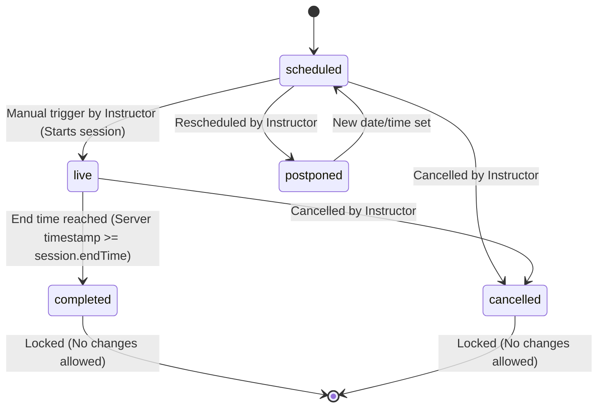

# Dev 2 Master Plan — Intern Management System (IMS) Backend

This document details the master implementation plan for **Dev 2**, responsible for building the **Curriculum, Course & Session Management, Notification System, and Code Review Job Queue** modules of the Intern Management System (IMS) backend.

This plan consolidates requirements from the **Project Lead Handbook**, the **Complete SRS**, and the **Compact SRS**, aligning them with the existing database schema in [schema.txt](file:///c:/Projects/Intern%20Management%20System%20(IMS)/IMS-Nexoresha/schema.txt).

---

## 1. System Architecture & Tech Stack

The backend is built as a RESTful JSON API using the MERN stack (without React for the backend).
*   **Runtime Environment:** Node.js (configured to use ES Modules with `"type": "module"` in [package.json](file:///c:/Projects/Intern%20Management%20System%20(IMS)/IMS-Nexoresha/package.json)).
*   **Database:** MongoDB via Mongoose. All models use UUID string formats for primary and foreign keys (via the `uuidId` helper in [modelHelpers.js](file:///c:/Projects/Intern%20Management%20System%20(IMS)/IMS-Nexoresha/src/models/modelHelpers.js)).
*   **Job Queue:** Bull (powered by Redis) for asynchronous processing of code reviews and scheduled notifications/reminders.
*   **Code Pattern:** Controller-Service-Model architecture. All async handlers must be wrapped in an `asyncHandler` middleware to let errors bubble to the global error handler.

---

## 2. Key Architectural Adjustments (Crucial Alignment)

Before implementing, you must adhere to the naming conventions and structure defined in the database schema which overrides standard terminology in the Project Lead Handbook:

| Project Lead Handbook Term | Database Schema / Production Term | File & Endpoint Impact |
| :--- | :--- | :--- |
| **Teacher** | **Instructor** | Routes `/api/v1/instructor/*`, Controller [instructorController.js](file:///c:/Projects/Intern%20Management%20System%20(IMS)/IMS-Nexoresha/src/controller/instructorController.js), Models [instructor.model.js](file:///c:/Projects/Intern%20Management%20System%20(IMS)/IMS-Nexoresha/src/models/instructor.model.js). |
| **Lecture** | **Session** | Routes `/api/v1/instructor/sessions`, Controller [sessionController.js](file:///c:/Projects/Intern%20Management%20System%20(IMS)/IMS-Nexoresha/src/controller/sessionController.js), Models [session.model.js](file:///c:/Projects/Intern%20Management%20System%20(IMS)/IMS-Nexoresha/src/models/session.model.js). |
| **Direct Batch &rarr; Session** | **Batch &rarr; Course &rarr; Session** | You must build Course CRUD operations, linking Instructors to Courses, and Sessions to Courses. |
| **Merged Submission** | **Separate Submission & Result** | [assignmentSubmission.model.js](file:///c:/Projects/Intern%20Management%20System%20(IMS)/IMS-Nexoresha/src/models/assignmentSubmission.model.js) (student) is separate from [assignmentResult.model.js](file:///c:/Projects/Intern%20Management%20System%20(IMS)/IMS-Nexoresha/src/models/assignmentResult.model.js) (API/Instructor evaluation). |
| **Marks / MarksApplied** | **Points** | Renamed across the ledger and student profiles. You will import Dev 1's service (e.g., `pointsService.js` or `ledgerService.js`) to apply points events. |
| **studentMetrics** | **Stored Metrics Table** | Option A is selected. Metrics are stored in the database. Dev 5's job is to update metrics on ledger changes, but you must trigger appropriate ledger events. |

---

## 3. Modules & File Ownership for Dev 2

You own the following files in the repository:

### 3.1 Models to Create & Modify (Extend only, do not remove/delete existing code)
*   **[NEW]** [topic.model.js](file:///c:/Projects/Intern%20Management%20System%20(IMS)/IMS-Nexoresha/src/models/topic.model.js) — Curriculum topics.
*   **[NEW]** [notification.model.js](file:///c:/Projects/Intern%20Management%20System%20(IMS)/IMS-Nexoresha/src/models/notification.model.js) — In-app notifications.
*   **[MODIFY]** [session.model.js](file:///c:/Projects/Intern%20Management%20System%20(IMS)/IMS-Nexoresha/src/models/session.model.js) — Add `batchId: { type: String, ref: 'Batch', required: true }` and `topicIds: [{ type: String, ref: 'Topic' }]`.
*   **[MODIFY]** [assignmentSubmission.model.js](file:///c:/Projects/Intern%20Management%20System%20(IMS)/IMS-Nexoresha/src/models/assignmentSubmission.model.js) — Add `reviewStatus: { type: String, enum: ['pending', 'completed', 'error'], default: 'pending' }` and `ledgerEventId: { type: String, ref: 'StudentLedger' }`.
*   **[MODIFY]** [instructor.model.js](file:///c:/Projects/Intern%20Management%20System%20(IMS)/IMS-Nexoresha/src/models/instructor.model.js) — Add `designation: { type: String, trim: true }`, `bio: { type: String, trim: true }`, and `photo: { type: String, trim: true }`.

### 3.2 Services to Implement
*   [curriculumService.js](file:///c:/Projects/Intern%20Management%20System%20(IMS)/IMS-Nexoresha/src/service/curriculumService.js) **[NEW]** — Topic CRUD and drag-and-drop ordering.
*   [sessionService.js](file:///c:/Projects/Intern%20Management%20System%20(IMS)/IMS-Nexoresha/src/service/sessionService.js) **[NEW]** — Session creation, scheduling, status transitions, and assignment publishing.
*   [notificationService.js](file:///c:/Projects/Intern%20Management%20System%20(IMS)/IMS-Nexoresha/src/service/notificationService.js) **[NEW]** — Notification delivery logic (in-app DB storage + transactional email) and delayed Bull job reminders.
*   [codeReviewService.js](file:///c:/Projects/Intern%20Management%20System%20(IMS)/IMS-Nexoresha/src/service/codeReviewService.js) **[NEW]** — Code review queue worker, external API integration, retry logic, and admin alerts.

### 3.3 Controllers & Routes
*   [instructorController.js](file:///c:/Projects/Intern%20Management%20System%20(IMS)/IMS-Nexoresha/src/controller/instructorController.js) **[NEW]** — Controller for instructor actions (managing topics, sessions, uploading notes).
*   [instructorRoutes.js](file:///c:/Projects/Intern%20Management%20System%20(IMS)/IMS-Nexoresha/src/routes/instructorRoutes.js) **[NEW]** — Endpoint registry for `/api/v1/instructor/*`.
*   [instructorValidator.js](file:///c:/Projects/Intern%20Management%20System%20(IMS)/IMS-Nexoresha/src/validator/instructorValidator.js) **[NEW]** — Request validation middleware using `express-validator`.

### 3.4 Utils & Background Jobs
*   [sessionReminders.js](file:///c:/Projects/Intern%20Management%20System%20(IMS)/IMS-Nexoresha/src/utils/cron/sessionReminders.js) **[NEW]** — Bull queue definition/cron setup for session reminders (T-24h, T-1h) and assignment deadlines.

---

## 4. Module Deep Dives & Business Rules

### 4.1 Curriculum & Course CRUD
1.  **Course CRUD:** Since sessions belong to a course, you must implement endpoints to create and update Courses, linking `instructorIds` to them.
2.  **Topic Schema Requirements:**
    ```javascript
    _id: uuidId,
    batchId: { type: String, ref: 'Batch', required: true },
    title: { type: String, required: true, maxlength: 120, trim: true },
    description: { type: String, required: true, trim: true }, // HTML Rich Text
    learningObjectives: [{ type: String }], // Array of strings (min 1, max 10)
    estimatedHours: { type: Number, required: true, min: 0 },
    orderIndex: { type: Number, required: true }, // Determines display sequence
    notesFiles: [{ type: String }] // File storage URLs (max 5 files per topic, max 10MB each)
    ```
    *Note:* You must add a compound unique index on `(batchId, orderIndex)` to enforce display order uniqueness per batch in the database:
    ```javascript
    topicSchema.index({ batchId: 1, orderIndex: 1 }, { unique: true });
    ```
3.  **Notes File Upload:** Allow instructors to upload notes (`PDF`, `.md`, `.docx`). Store notes on local server storage or S3-compatible storage. Enforce a file size limit of 10 MB per file, max 5 files per topic.
4.  **Reordering Logic:** Drag-and-drop reordering must accept an ordered array of topic IDs: `PATCH /api/v1/instructor/topics/reorder`. Update the `orderIndex` of each topic in a single batch operation.
5.  **Safe Deletion:** Deleting a topic is blocked if it is already linked to any session. Verify this by checking if the topic's ID exists in the `topicIds` array of any session document.

### 4.2 Session CRUD & Transitions
Sessions represent scheduled events. You must enforce the following transition rules in `sessionService.js`:



*   **Scheduled &rarr; Live (In Progress):** Triggered manually by the instructor. Side Effect: Set `actualStartTime` to `Date.now()`.
*   **Live &rarr; Completed:** Transition blocked unless `Date.now() >= session.endTime` (computed from `sessionDateAndTime` + `duration`). Returns `HTTP 400` if triggered too early.
    *   **Side Effect — Assignment Auto-Publish:**
        1.  Create an `Assignment` document linked to the session, status is implicitly 'published'.
        2.  Set `assignment.submissionDeadline` from `session.assignmentDeadline`.
        3.  Save the assignment, then send an `assignment_published` in-app notification + email to all students in the batch.
        4.  Schedule a Bull reminder job for `deadline - 24 hours` targeting students who haven't submitted yet.
*   **Scheduled/Live &rarr; Cancelled:** Instructor cancels the session. Side Effect: Send `session_cancelled` notifications. No points/marks are applied.
*   **Completed or Cancelled &rarr; Any:** BLOCKED. Return `HTTP 400` with an error message.

### 4.3 Notification Service
Your `notificationService.js` is a shared module. Other developers (Dev 3, Dev 4) will import and call your functions. You must implement and export the following functions exactly:

```javascript
/**
 * Saves a notification to the database for a specific user.
 */
async function createNotification(userId, type, message, meta = {}) { ... }

/**
 * Sends a transactional email using the SMTP provider configured in .env.
 */
async function sendEmail(to, subject, html) { ... }

/**
 * Sends an in-app notification and email to all active students in a batch.
 */
async function notifyBatch(batchId, type, message, meta = {}) { ... }

/**
 * Sends an in-app notification and email to all 4 system admins.
 */
async function notifyAdmins(type, message, meta = {}) { ... }

/**
 * Schedules a delayed Bull job to trigger a notification at a specific time.
 */
async function scheduleReminder(sessionId, fireAt, type) { ... }
```

**Required Notification Events:**
1.  `session_scheduled`: Sent to students immediately upon session creation (In-app + Email).
2.  `session_reminder`: Sent at `T-24h` and `T-1h` before session start (In-app + Email).
3.  `session_cancelled`: Sent immediately upon session cancellation (In-app + Email).
4.  `assignment_published`: Sent on session transition to `completed` (In-app + Email).
5.  `assignment_approaching`: Sent at `T-24h` before deadline to students who haven't submitted (In-app + Email).
6.  `assignment_deadline_passed`: Sent immediately after deadline to students who didn't submit (In-app).
7.  `attendance_csv_uploaded`: Confirmation sent to instructor upon successful attendance CSV upload (In-app).
8.  `quiz_csv_rejected`: Sent to instructor immediately upon quiz CSV validation error (In-app).
9.  `code_review_completed`: Sent to student when evaluation completes (In-app + Email).
10. `code_review_error`: Sent to all 4 admins on worker failure (In-app + Email).
11. `marks_updated`: Sent to student on admin mark override (In-app + Email).
12. `recalculation_completed`: Sent to admins when full recalculation finishes (In-app).

### 4.4 Code Review Job Queue
1.  **Worker Initialization:** Set up a Bull queue named `code-review` using `process.env.REDIS_URL`.
2.  **Job Enqueueing:** When a student submits their repo, Dev 3 calls `codeReviewService.queueReview(submissionId)`.
    *   Job Options: `attempts: 3`, backoff configuration set to exponential with delays of **1 min, 5 min, and 15 min** (using custom backoff strategy configured in Bull settings).
3.  **Worker Processing Logic:**
    *   Fetch the `AssignmentSubmission` by `submissionId`.
    *   Extract the `gitSubmissionLink`.
    *   Call `CODE_REVIEW_API_URL` passing the GitHub link in the payload. Include `CODE_REVIEW_API_KEY` in the authorization headers.
    *   **On Success:**
        1.  Create an `AssignmentResult` document. Record `marksObtained` (0-10), `codeQualityScore`, `feedback`, and calculate points.
        2.  Set `points` = 0 if the submission was late (i.e. `onTimeSubmission == false` or `submittedAt > submissionDeadline`), otherwise `points = marksObtained`.
        3.  Calculate `percentage = (marksObtained / 10) * 100` and `totalPoints = points + bonusPoints` (where `bonusPoints` default is 0).
        4.  Determine pass/fail status: set `result = 'pass'` if `marksObtained >= 7` (the Topics Mastered threshold), otherwise `result = 'failed'`.
        5.  Update the submission: `reviewStatus = 'completed'`, link `ledgerEventId` to the newly created ledger entry.
        6.  Call the Dev 1 ledger service (e.g. `pointsService.applyPointsEvent`) to append an entry to the `StudentLedger` with the awarded points.
        7.  Trigger `createNotification` for the student: type = `code_review_completed`.
    *   **On Error (Temporary / Retriable):**
        *   Throw an error so Bull retries the job.
    *   **On Failure (All 3 retries exhausted):**
        *   Inside the `.on('failed')` listener:
        1.  Set the submission's `reviewStatus = 'error'`.
        2.  Notify all 4 admins using `notifyAdmins('code_review_error', message)`.
        3.  Set `marksObtained` to "Pending" (or hold the evaluation state) until an admin manually overrides it or triggers a manual re-review.

### 4.5 Instructor Profile & Dashboard
1.  **Dashboard Data Aggregation:** Implement `GET /api/v1/instructor/dashboard` to return:
    *   List of upcoming sessions (scheduled for the next 7 days).
    *   Pending attendance uploads (sessions marked `completed` but with no attendance CSV uploaded yet).
    *   Pending quiz uploads.
2.  **Profile Management:** Implement `PUT /api/v1/instructor/profile` to allow instructors to edit their `name`, `designation`, `bio`, and `photo` (using `multipart/form-data` for the image upload). Name and designation will be displayed publicly on the recruiter batch overview page.
3.  **Student Breakdown:** Implement `GET /api/v1/instructor/students/:batchId` to display the points breakdown for all students enrolled in the instructor's assigned batches.
4.  **Session Metrics Summary:** Implement `GET /api/v1/instructor/sessions/summary/:sessionId` to compute and return attendance counts, average quiz score, and average assignment score for a completed session.

---

## 5. Consolidated API Endpoints (Owned by Dev 2)

All endpoints must be mounted on `/api/v1/instructor` (or related paths) and wrapped with `verifyToken` and `requireRole('instructor')`.

### Profile & Dashboard Endpoints
*   **GET** `/api/v1/instructor/dashboard` — Retrieve instructor dashboard statistics.
*   **PUT** `/api/v1/instructor/profile` — Update instructor profile details (name, designation, bio, photo).
*   **GET** `/api/v1/instructor/batches` — List all batches assigned to the logged-in instructor.
*   **GET** `/api/v1/instructor/students/:batchId` — View the student points breakdown for a batch.
*   **GET** `/api/v1/instructor/sessions/summary/:sessionId` — View the session metrics summary (attendance count, avg quiz, avg assignment).

### Course & Curriculum Endpoints
*   **GET** `/api/v1/instructor/courses` — List all courses assigned to the logged-in instructor.
*   **POST** `/api/v1/instructor/courses` — Create a new course (Dev 2 addition for the schema).
*   **GET** `/api/v1/instructor/topics/:batchId` — Retrieve all curriculum topics ordered by `orderIndex`.
*   **POST** `/api/v1/instructor/topics` — Create a curriculum topic (includes notes file upload using `multipart/form-data`).
*   **PUT** `/api/v1/instructor/topics/:id` — Edit curriculum topic details.
*   **DELETE** `/api/v1/instructor/topics/:id` — Remove a topic (fails with `400` if session is linked).
*   **PATCH** `/api/v1/instructor/topics/reorder` — Reorder topics (body: `{ topicIds: [] }`).
*   **POST** `/api/v1/instructor/topics/:id/notes` — Upload a notes file to a topic.
*   **DELETE** `/api/v1/instructor/topics/:id/notes/:fileId` — Delete a notes file.

### Session & Assignment Endpoints
*   **GET** `/api/v1/instructor/sessions/:batchId` — List all sessions for a batch.
*   **POST** `/api/v1/instructor/sessions` — Create and schedule a session.
*   **PUT** `/api/v1/instructor/sessions/:id` — Update session details (only allowed if status is `scheduled`).
*   **PATCH** `/api/v1/instructor/sessions/:id/status` — Transition session status (Scheduled &rarr; Live &rarr; Completed / Cancelled).
*   **DELETE** `/api/v1/instructor/sessions/:id` — Cancel a session (sets status to `cancelled`, triggers alerts).

---

## 6. Implementation Master Plan (Phase-by-Phase)

### Phase 1: Models Setup & Registration (Extend existing models, do not delete/remove code)
1.  Create [topic.model.js](file:///c:/Projects/Intern Management System (IMS)/IMS-Nexoresha/src/models/topic.model.js) and [notification.model.js](file:///c:/Projects/Intern Management System (IMS)/IMS-Nexoresha/src/models/notification.model.js).
2.  Extend existing models (adding fields only, leaving existing code untouched):
    *   Add `batchId` and `topicIds` to [session.model.js](file:///c:/Projects/Intern Management System (IMS)/IMS-Nexoresha/src/models/session.model.js).
    *   Add `reviewStatus` and `ledgerEventId` to [assignmentSubmission.model.js](file:///c:/Projects/Intern Management System (IMS)/IMS-Nexoresha/src/models/assignmentSubmission.model.js).
    *   Add `designation`, `bio`, and `photo` to [instructor.model.js](file:///c:/Projects/Intern Management System (IMS)/IMS-Nexoresha/src/models/instructor.model.js).
3.  Register and export them in [src/models/index.js](file:///c:/Projects/Intern%20Management%20System%20(IMS)/IMS-Nexoresha/src/models/index.js).

### Phase 2: Notification & Email System
1.  Implement `notificationService.js`. Set up SMTP transporter using values from `.env` (`EMAIL_HOST`, `EMAIL_PORT`, etc.).
2.  Implement `createNotification`, `sendEmail`, `notifyBatch`, and `notifyAdmins`.
3.  *Note:* Export this service early so that Dev 3 and Dev 4 can import and use it without delay.

### Phase 3: Curriculum & Session Management Services
1.  Implement `curriculumService.js` with reorder, notes upload logic, and delete-safe guard checks.
2.  Implement `sessionService.js` containing the transition validation logic and side effects (assignment publication, job scheduling).
3.  Define the Bull reminders worker in `sessionReminders.js` for handling T-24h and T-1h reminders.

### Phase 4: Code Review Background Queue
1.  Initialize Bull queue `code-review` in `codeReviewService.js`.
2.  Write the worker logic: call `CODE_REVIEW_API_URL` via `fetch`/`axios`, handle the success case (creating `AssignmentResult` and triggering points events), and setup the `.on('failed')` fallback listener for administrative alerts.

### Phase 5: Routing, Controllers & Validation
1.  Create `instructorValidator.js` to validate query params and request bodies.
2.  Implement `instructorController.js` mapping express routes to the services.
3.  Register routes in `instructorRoutes.js` and mount it under `/api/v1/instructor` in [src/routes/index.js](file:///c:/Projects/Intern%20Management%20System%20(IMS)/IMS-Nexoresha/src/routes/index.js).

---

## 7. Dependencies & Coordination Checklist

*   [ ] **Shared Auth Middleware:** Wait for Dev 1 to push `verifyToken` and `requireRole` in `src/middleware/auth.js` before securing routes.
*   [ ] **Shared Core Models:** Verify Dev 1 has updated `user.model.js`, `student.model.js`, and `batch.model.js` to support UUID schemas.
*   [ ] **Shared Ledger Service:** Ensure Dev 1 provides the points addition service (e.g. `pointsService.applyPointsEvent`) so you can award points from the code review worker.
*   [ ] **Student Submissions:** Coordination with Dev 3 on when the `Assignment` model is ready, as Dev 3's submissions depend on the assignment records you auto-create.
*   [ ] **Library Dependencies:** Install necessary libraries: `npm install bull nodemailer express-validator multer`
*   [ ] **Environment Configurations:** Ensure `REDIS_URL` is added to your local `.env` and `.env.example`.
